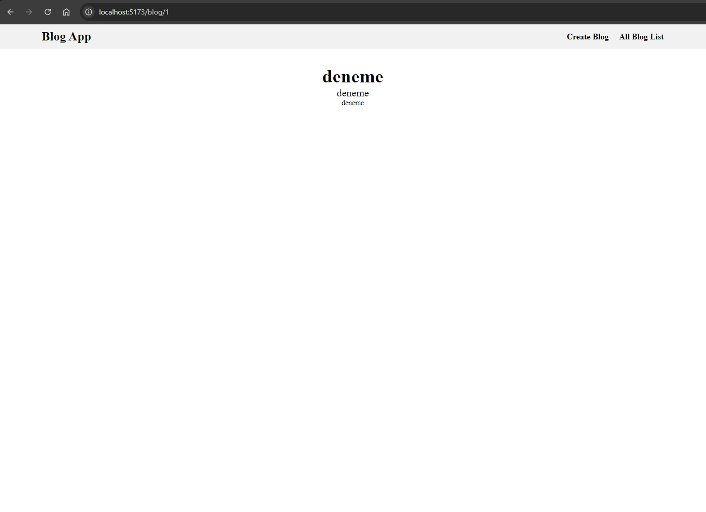
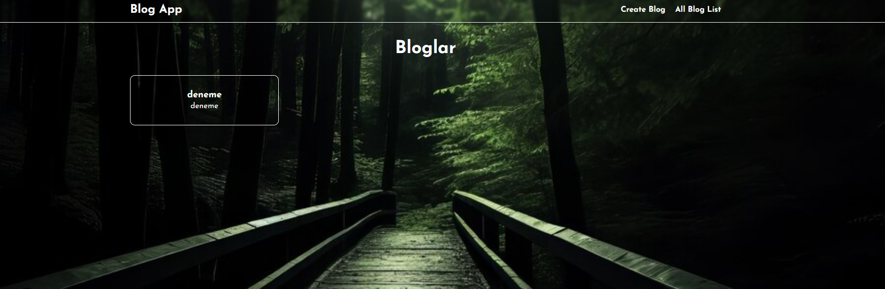
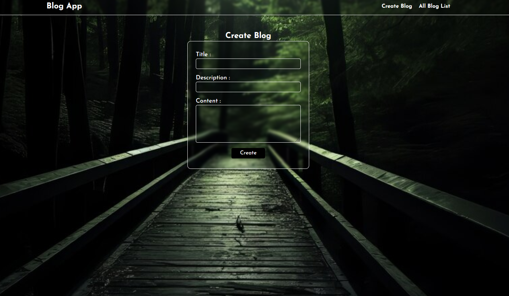
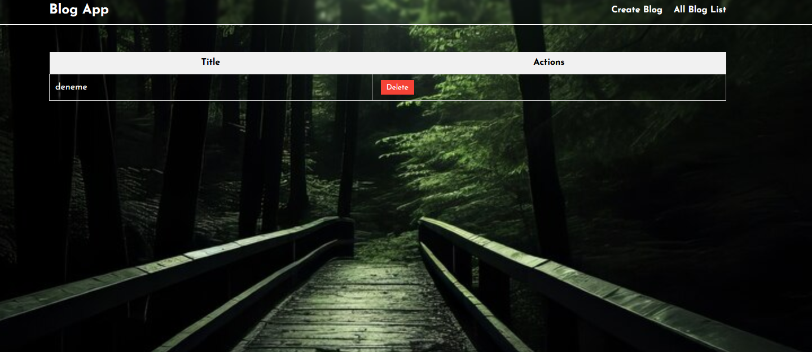

## FullStack Blog App

- Merhaba arkadaşlar bu repo ile bir blog uygulaması geliştireceğiz ancak sadece readme dosyasına bakarak yapmak yerine kodlarıda inceleyerek çalışırsanız daha anlaşılır olacaktır

- Projede çok fazla css yazmayacağım sadece temel bir blog listesi yapacağım bu sayede mantığını anlamak daha kolay olacaktır ek olarak css değil scss kullanacağım

- Daha sonraki projelerde ise daha farklı ve gelişmiş css kütüphaneleri ve özellikler ekleyerek Frontend kısmında güçlü projelerde geliştirip onları da bu şekilde paylaşacağım

- Şimdiden herkese iyi kodlamalar dilerim
  ***

* Dosya yapısını ben resimde ki gibi yaptım siz isterseniz farklı bir yapı kurabilirsiniz
  

### Backend

- MYSQL ile veritabamı tablo yapısını bu şekilde kurdum


- Şimdi ise veri tabanı bağlantısını yapalım
- Bir .env dosyası oluşturup veritabanı bilgilerinizi orada tutun

```bash
//.env
DB_HOST=localhost
DB_USER=root
DB_PASSWORD=yourpassword
DB_NAME=yourdatabasename
PORT=5000

```

```bash
//services/db.js
const mysql = require('mysql2')
require('dotenv').config()

// MySQL bağlantısı
const pool = mysql.createPool({
connectionLimit: 10,
host: process.env.DB_HOST,
user: process.env.DB_USER,
password: process.env.DB_PASSWORD,
database: process.env.DB_NAME,
})

pool.on('error', (err) => {
console.error('MySQL error:', err)
})

module.exports = pool.promise()

```

```bash
//index.js
const express = require('express')
const cors = require('cors')
require('dotenv').config()

// Rota dosyalarını içe aktar
const blogRoutes = require('./routes/blogs')

const app = express()
const port = process.env.PORT || 5000

app.use(cors())
app.use(express.json())

app.use('/', blogRoutes)

app.listen(port, () => {
  console.log(`Server running on port ${port}`)
})

```

- İlk olarak backend kısmında kullanılacak olan routerları ve db ye sorgu göndermek için servisleri oluşturacağız
- Bunun için routes klasörü altında blogs.js ve services klasörü altında blogService.js dosyasını oluşturacağız
- İçine aşağıdaki kodları en üstte yorum satırları olarak belirttğim dosyaları açıp yazacağız

```bash
//service/blogService.js
const db = require('./db')

const getAllBlogs = async () => {
  const [rows] = await db.query('SELECT * FROM blogs')
  return rows
}

module.exports = {
  getAllBlogs,
}


// routes/blogs.js
const express = require('express')
const router = express.Router()
const blogService = require('../services/blogService')

router.get('/api/blogs', async (req, res) => {
  try {
    const blogs = await blogService.getAllBlogs()
    res.json(blogs)
  } catch (error) {
    res.status(500).json({ error: 'Internal Server Error' })
  }
})
module.exports = router
```

- Şimdi ise Frontend kısmını başlatalım

### Frontend

- Frontend kısmında ise react kullanarak bir blog listesi oluşturacağız
- Bunun npm create vite@latest ile bir react projesi oluşturacağız
- İçine aşağıdaki kodları yazacağız

```bash
//App.js
import React, { useEffect, useState } from 'react'
import './App.css'

function App() {
  const [blogs, setBlogs] = useState([])

  useEffect(() => {
    const fetchBlogs = async () => {
      try {
        const response = await fetch('http://localhost:5000/api/blogs')
        const data = await response.json()
        if (Array.isArray(data)) {
          setBlogs(data)
        } else {
          console.error('Fetched data is not an array:', data)
        }
      } catch (error) {
        console.error('Error fetching blogs:', error)
      }
    }

    fetchBlogs()
  }, [])

  return (
    <div>
      <h1>Blog Listesi</h1>
      <ul>
        {blogs.map(blog => (
          <li key={blog.id}>{blog.title}</li>
        ))}
      </ul>
    </div>
  )
}

export default App
```

- DB de elimizle örnek bir veri girerek veriler geliyor mu kontrol edelim.
  

- Gördüğünüz gibi verileri başarılı bir şekilde çektik artık arayüzü kodlamaya başlayabiliriz

- Ömcelikle app.js i düzenleyerek react router kurulumunu yapalım

```bash
//App.js
import { useEffect, useState } from 'react'
import './index.scss'
import BlogsWrapper from './Components/Home/Navbar/Blogs/BlogsWrapper'
import BlogDetails from './Views/BlogDetails'
import { BrowserRouter as Router, Routes, Route } from 'react-router-dom'
import CreateBlog from './Views/CreateBlog'
import AllBlogs from './Views/AllBlogs'

function App() {
  const [blogs, setBlogs] = useState([])

  useEffect(() => {
    const fetchBlogs = async () => {
      try {
        const response = await fetch('http://localhost:5000/api/blogs')
        const data = await response.json()
        if (Array.isArray(data)) {
          setBlogs(data)
        } else {
          console.error('Fetched data is not an array:', data)
        }
      } catch (error) {
        console.error('Error fetching blogs:', error)
      }
    }

    fetchBlogs()
  }, [])

  return (
    <Router>
      <main>
        <Routes>
          <Route path="/" element={<BlogsWrapper blogs={blogs} />} />
          <Route path="/blog/:id" element={<BlogDetails />} />
          <Route path="/createblog" element={<CreateBlog />} />
          <Route path="/allblogs" element={<AllBlogs />} />
        </Routes>
      </main>
    </Router>
  )
}

export default App
```

- CSS kısmını tamamen size bırakıyorum sadece şu şekilde bir mixin yapısı oluşturdum dilerseniz bunu kullanabilirsiniz

```bash
@mixin Flexible($flex, $justify, $align) {
  display: $flex;
  justify-content: $justify;
  align-items: $align;
}

@mixin Typography($font-size, $font-weight) {
  font-size: $font-size;
  font-weight: $font-weight;
}

```

- BlogsWrapper.jsx

```bash
import Card from "../../../Ui/Card"

const BlogsWrapper = ({ blogs }) => {
    return (
        <section className="blogs-wrapper">
            <div className="container">
                <div className="blogs-wrapper-title">
                    <h2>Bloglar</h2>
                </div>
                <div className="blogs-wrapper-container">
                    {blogs.map((blog) => (
                        <Card key={blog.blogsid} blog={blog} />
                    ))}
                </div>
            </div>
        </section>
    )
}

export default BlogsWrapper
```

- Burada ben bir cart componenti oluşturdum bunu da size bırakıyorum component oluşturmadan direkt kullanabilirsiniz

- Detay Sayfasında ise aşağıdaki gibi bir yapı oluşturabilirsiniz

* Detay sayfasının backend kısmını yapalım

```bash

//blogService.js
const getBlogById = async (id) => {
  const [rows] = await db.query('SELECT * FROM blogs WHERE blogsid = ?', [id])
  return rows[0]
}


***


//blogs.js
router
  .get('/api/blogs/:id', async (req, res) => {
    try {
      const blog = await blogService.getBlogById(req.params.id)
      res.json(blog)
    } catch (error) {
      res.status(500).json({ error: 'Internal Server Error' })
    }
  })

```

- Detay sayfasının frontend kısmını yapalım
  -Views klasörü altında BlogsDetails.jsx dosyasını oluşturup aşağıdaki kodları yazın

```bash
import { useEffect, useState } from 'react'
import { useParams } from 'react-router-dom'

const BlogDetails = () => {
    const { id } = useParams()
    const [blog, setBlog] = useState(null)

    useEffect(() => {
        const fetchBlog = async () => {
            const response = await fetch(`http://localhost:5000/api/blogs/${id}`)
            const data = await response.json()
            setBlog(data)
        }
        fetchBlog()
    }, [id])

    if (!blog) return <div>Loading...</div>
    return (
        <section className="blog-details-page">
            <div className="container">
                <div className="blog-details-page-title">
                    <h2 className="blog-details-page-title-text">{blog.title}</h2>
                </div>
                <div className="blog-details-page-content">
                    <p className="blog-details-page-description-text">{blog.description}</p>
                    <p className="blog-details-page-content-text">{blog.content}</p>
                </div>
            </div>
        </section>
    )
}

export default BlogDetails

```



- Blog detayları geldi

- Şimdi ise Blog oluşturma sayfasını yapalım
- Views klasörü altında CreateBlog.jsx dosyasını oluşturun

* Backend kısmını yapalım

```bash
//blogService.js
const createBlog = async (title, description, content) => {
  const [result] = await db.query(
    'INSERT INTO blogs (title, description, content) VALUES (?, ?, ?)',
    [title, description, content],
  )
  return result
}

module.exports = {
  getAllBlogs,
  getBlogById,
  createBlog,
}


***

//blogs.js
router.post('/api/createblog', async (req, res) => {
  try {
    const { title, description, content } = req.body
    const result = await blogService.createBlog(title, description, content)
    res.json(result)
    res.redirect('/')
  } catch (error) {
    res.status(500).json({ error: 'Internal Server Error' })
  }
})

```

- Frontend kısmını yapalım

```bash
import { useState } from "react"


const CreateBlog = () => {
    const [formData, setFormData] = useState({
        title: '',
        description: '',
        content: ''
    })

    const handleChange = (e) => {
        setFormData({ ...formData, [e.target.name]: e.target.value })
    }

    const handleSubmit = async (e) => {
        e.preventDefault()
        try {
            const response = await fetch('http://localhost:5000/api/createblog', {
                method: 'POST',
                headers: {
                    'Content-Type': 'application/json'
                },
                body: JSON.stringify(formData)
            })
            if (response.ok) {
                const data = await response.json()
                console.log(data)
            } else {
                console.log('Error')
            }
        } catch (error) {
            console.log(error)
        }
    }

    return (
        <section className="create-blog-page">
            <div className="container">
                <h1>Create Blog</h1>
                <form onSubmit={handleSubmit} >
                    <div>
                        <label htmlFor="title">Title : </label>
                        <input onChange={handleChange} type="text" id="title" name="title" />
                    </div>
                    <div>
                        <label htmlFor="description">Description : </label>
                        <input onChange={handleChange} type="text" id="description" name="description" />
                    </div>
                    <div>
                        <label htmlFor="content">Content : </label>
                        <textarea onChange={handleChange} id="content" name="content" />
                    </div>
                    <button type="submit">Create</button>
                </form>
            </div>
        </section>
    )
}

export default CreateBlog

```

- Tüm blogları göstermek için ise AllBlogs.jsx dosyasını oluşturup aşağıdaki kodları yazalım.

```bash
//blogService.js kısmına aşağıdaki kodları ekleyin ve export edin
const deleteBlog = async (id) => {
  const [result] = await db.query('DELETE FROM blogs WHERE blogsid = ?', [id])
  return result
}

module.exports = {
  deleteBlog,
}


//blogs.js kısmına aşağıdaki kodları ekleyin
router.delete('/api/blogs/:id', async (req, res) => {
  try {
    const result = await blogService.deleteBlog(req.params.id)
    res.json(result)
  } catch (error) {
    res.status(500).json({ error: 'Internal Server Error' })
  }
})
```

- Frontend kısmını yapalım

```bash


import { useEffect, useState } from "react"

const AllBlogs = () => {
    const [blogs, setBlogs] = useState([])

    useEffect(() => {
        const fetchBlogs = async () => {
            try {
                const response = await fetch('http://localhost:5000/api/blogs')
                const data = await response.json()
                setBlogs(data)
            } catch (error) {
                console.error('Error fetching blogs:', error)
            }
        }

        fetchBlogs()
    }, [])

    const handleDelete = async (id) => {
        try {
            await fetch(`http://localhost:5000/api/blogs/${id}`, {
                method: 'DELETE',
            })
            setBlogs(blogs.filter((blog) => blog.blogsid !== id))
        } catch (error) {
            console.error('Error deleting blog:', error)
        }
    }

    return (
        <section className="all-blog-list">
            <div className="container">
                <table className="blog-table">

                    <thead>
                        <tr>
                            <th className="blog-title">Title</th>
                            <th className="blog-actions">Actions</th>
                        </tr>
                    </thead>

                    <tbody>
                        {blogs.map((blog) => (
                            <tr key={blog.id}>
                                <td>{blog.title}</td>
                                <td>
                                    <button onClick={() => handleDelete(blog.blogsid)} className="delete-button">Delete</button>
                                </td>
                            </tr>
                        ))}
                    </tbody>

                </table>
            </div>
        </section>
    )
}

export default AllBlogs


```

## Ufak tefek css düzenlemeleri yaparak projeyi tamamladım dokümantosyon başında dediğim gibi css tarafını siz kendi zevkinize göre düzenleyebilirsiniz. Eğer sizlere yardımcı olabildiysem ne mutlu bana. Size ve sevdiklerinize sağlık günler dilerim, iyi kodlamalar...

- ***

## Proje Resimleri






