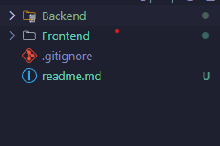
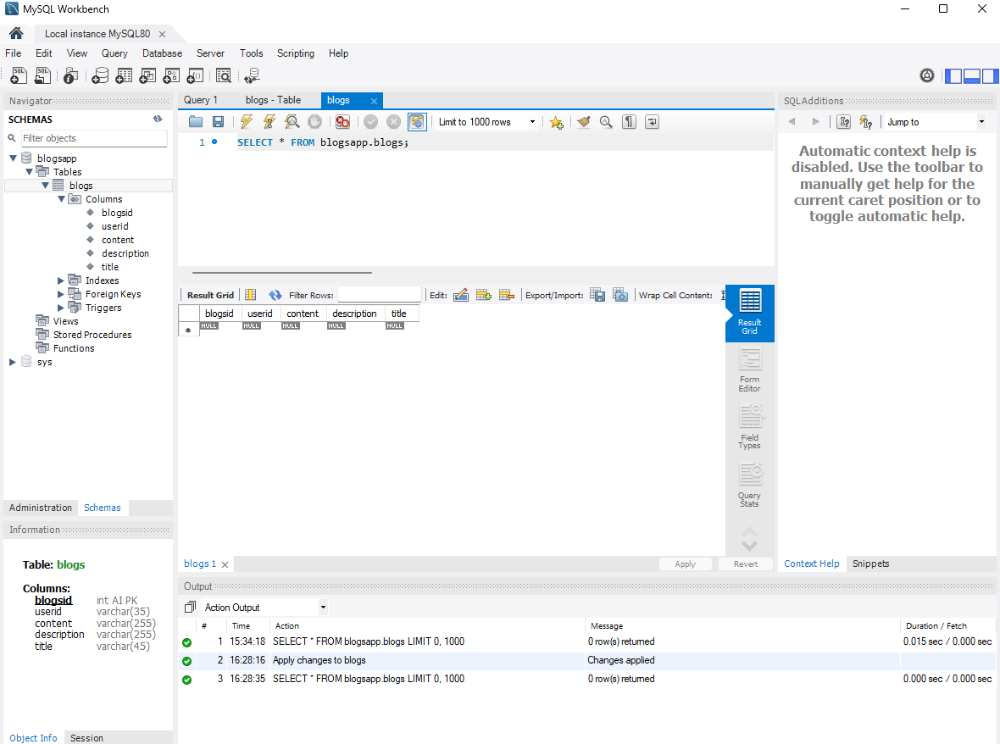
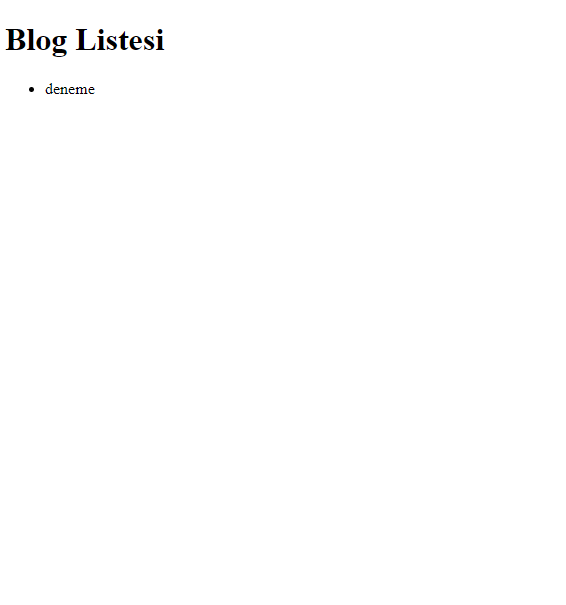

## FullStack Blog App

- Merhaba arkadaşlar bu repo ile bir blog uygulaması geliştireceğiz ancak sadece readme dosyasına bakarak yapmak yerine kodlarıda inceleyerek çalışırsanız daha anlaşılır olacaktır

- Projede çok fazla css yazmayacağım sadece temel bir blog listesi yapacağım bu sayede mantığını anlamak daha kolay olacaktır ek olarak css değil scss kullanacağım

- Daha sonraki projelerde ise daha farklı ve gelişmiş css kütüphaneleri ve özellikler ekleyerek Frontend kısmında güçlü projelerde geliştirip onları da bu şekilde paylaşacağım

- Şimdiden herkese iyi kodlamalar dilerim
  ***

* Dosya yapısını ben resimde ki gibi yaptım siz isterseniz farklı bir yapı kurabilirsiniz
  

### Backend

- MYSQL ile veritabanı oluşturduğunuzda tablo yapısını kurdum



- Şimdi ise veri tabanı bağlantısını yapalım
- Bir .env dosyası oluşturup veritabanı bilgilerinizi orada tutun

```bash
//.env
DB_HOST=localhost
DB_USER=root
DB_PASSWORD=yourpassword
DB_NAME=yourdatabasename
PORT=5000

```

```bash
//services/db.js
const mysql = require('mysql2')
require('dotenv').config()

// MySQL bağlantısı
const pool = mysql.createPool({
connectionLimit: 10,
host: process.env.DB_HOST,
user: process.env.DB_USER,
password: process.env.DB_PASSWORD,
database: process.env.DB_NAME,
})

pool.on('error', (err) => {
console.error('MySQL error:', err)
})

module.exports = pool.promise()

```

```bash
//index.js
const express = require('express')
const cors = require('cors')
require('dotenv').config()

// Rota dosyalarını içe aktar
const blogRoutes = require('./routes/blogs')

const app = express()
const port = process.env.PORT || 5000

app.use(cors())
app.use(express.json())

app.use('/', blogRoutes)

app.listen(port, () => {
  console.log(`Server running on port ${port}`)
})

```

- İlk olarak backend kısmında kullanılacak olan routerları ve db ye sorgu göndermek için servisleri oluşturacağız
- Bunun için routes klasörü altında blogs.js dosyasını oluşturacağız
- İçine aşağıdaki kodları yazacağız

```bash
//service/blogService.js
const db = require('./db')

const getAllBlogs = async () => {
  const [rows] = await db.query('SELECT * FROM blogs')
  return rows
}

module.exports = {
  getAllBlogs,
}


// routes/blogs.js
const express = require('express')
const router = express.Router()
const blogService = require('../services/blogService')

router.get('/api/blogs', async (req, res) => {
  try {
    const blogs = await blogService.getAllBlogs()
    res.json(blogs)
  } catch (error) {
    res.status(500).json({ error: 'Internal Server Error' })
  }
})
module.exports = router
```

- Şimdi ise Frontend kısmını başlatalım

### Frontend

- Frontend kısmında ise react kullanarak bir blog listesi oluşturacağız
- Bunun npm create vite@latest ile bir react projesi oluşturacağız
- İçine aşağıdaki kodları yazacağız

```bash
//App.js
import React, { useEffect, useState } from 'react'
import './App.css'

function App() {
  const [blogs, setBlogs] = useState([])

  useEffect(() => {
    const fetchBlogs = async () => {
      try {
        const response = await fetch('http://localhost:5000/api/blogs')
        const data = await response.json()
        if (Array.isArray(data)) {
          setBlogs(data)
        } else {
          console.error('Fetched data is not an array:', data)
        }
      } catch (error) {
        console.error('Error fetching blogs:', error)
      }
    }

    fetchBlogs()
  }, [])

  return (
    <div>
      <h1>Blog Listesi</h1>
      <ul>
        {blogs.map(blog => (
          <li key={blog.id}>{blog.title}</li>
        ))}
      </ul>
    </div>
  )
}

export default App
```

- DB de elimizle örnek bir veri girerek veriler geliyor mu kontrol edelim.
  

- Gördüğünüz gibi verileri başarılı bir şekilde çektik artık arayüzü kodlamaya başlayabiliriz
